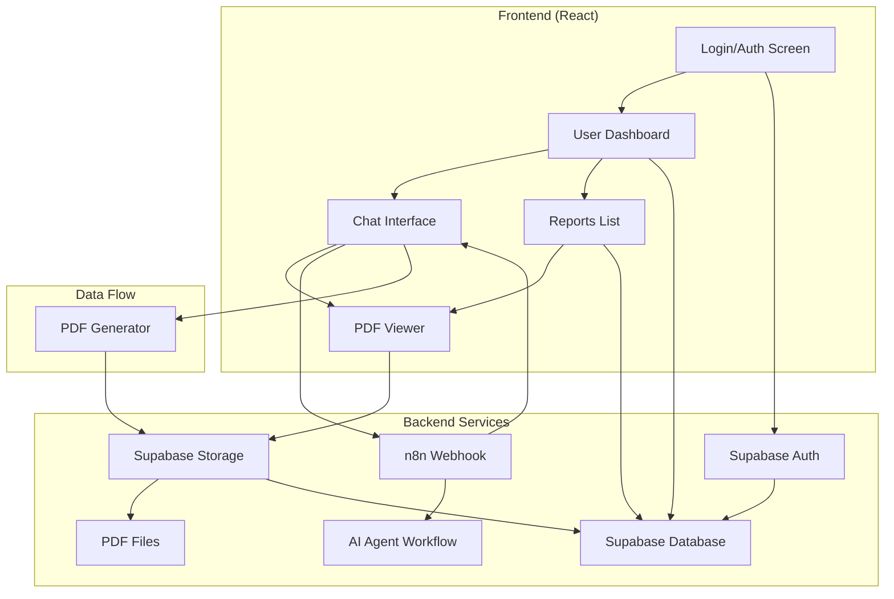
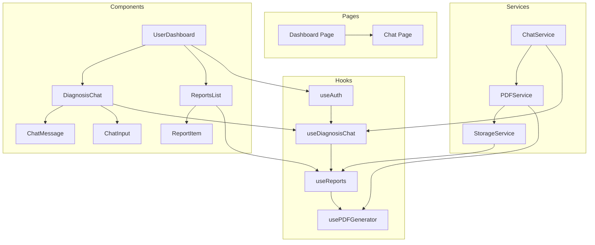

# Design Document

## Overview

O sistema de integração do agente de pré-diagnóstico será implementado como uma extensão do aplicativo Valente-Conecta existente, aproveitando a infraestrutura atual do Supabase e React. A arquitetura seguirá os padrões já estabelecidos no projeto, utilizando hooks customizados, componentes reutilizáveis e integração com APIs externas.

O sistema consistirá em três módulos principais:
1. **Módulo de Autenticação** - Extensão do sistema existente
2. **Módulo de Chat Conversacional** - Nova interface para interação com IA
3. **Módulo de Relatórios** - Geração, armazenamento e visualização de PDFs

## Architecture

### High-Level Architecture



### Component Architecture



## Components and Interfaces

### 1. Authentication Extension

**Componente:** `AuthGuard`
- Extensão do sistema de autenticação existente
- Proteção de rotas para funcionalidades de diagnóstico
- Redirecionamento automático para login quando necessário

**Interface:**
```typescript
interface AuthGuardProps {
  children: React.ReactNode;
  requireAuth?: boolean;
  redirectTo?: string;
}
```

### 2. User Dashboard

**Componente:** `DiagnosisDashboard`
- Painel principal para usuários autenticados
- Botão para iniciar novo diagnóstico
- Lista de relatórios anteriores
- Navegação para diferentes seções

**Interface:**
```typescript
interface DiagnosisDashboardProps {
  user: User;
  reports: DiagnosisReport[];
  onStartDiagnosis: () => void;
  onViewReport: (reportId: string) => void;
}

interface DiagnosisReport {
  id: string;
  user_id: string;
  created_at: string;
  pdf_url: string;
  title: string;
  status: 'completed' | 'processing' | 'error';
}
```

### 3. Chat Interface

**Componente:** `DiagnosisChat`
- Interface de chat conversacional
- Área de mensagens com scroll automático
- Campo de entrada com validação
- Indicadores de status (digitando, enviando, erro)

**Interface:**
```typescript
interface DiagnosisChatProps {
  sessionId?: string;
  onSessionComplete: (finalData: any) => void;
  onError: (error: Error) => void;
}

interface ChatMessage {
  id: string;
  type: 'user' | 'ai' | 'system';
  content: string;
  timestamp: Date;
  status?: 'sending' | 'sent' | 'error';
}
```

### 4. PDF Generator and Viewer

**Componente:** `PDFGenerator`
- Conversão de JSON para PDF formatado
- Templates para diferentes tipos de relatório
- Otimização para dispositivos móveis

**Interface:**
```typescript
interface PDFGeneratorProps {
  data: DiagnosisData;
  template: 'standard' | 'detailed';
  onGenerated: (pdfBlob: Blob) => void;
  onError: (error: Error) => void;
}

interface DiagnosisData {
  patient_info: PatientInfo;
  symptoms: Symptom[];
  analysis: string;
  recommendations: string[];
  severity_level: number;
  generated_at: string;
}
```

### 5. Reports Management

**Componente:** `ReportsList`
- Listagem de relatórios do usuário
- Filtros por data e status
- Ações de visualização e download

**Interface:**
```typescript
interface ReportsListProps {
  userId: string;
  onViewReport: (report: DiagnosisReport) => void;
  onDownloadReport: (report: DiagnosisReport) => void;
}
```

## Data Models

### Database Schema Extensions

```sql
-- Tabela para armazenar relatórios de diagnóstico
CREATE TABLE relatorios_diagnostico (
  id UUID PRIMARY KEY DEFAULT gen_random_uuid(),
  user_id UUID REFERENCES auth.users(id) ON DELETE CASCADE,
  session_id VARCHAR(255) UNIQUE,
  pdf_url TEXT NOT NULL,
  title VARCHAR(255) NOT NULL,
  diagnosis_data JSONB,
  status VARCHAR(50) DEFAULT 'completed',
  created_at TIMESTAMP WITH TIME ZONE DEFAULT NOW(),
  updated_at TIMESTAMP WITH TIME ZONE DEFAULT NOW()
);

-- Tabela para sessões de chat (opcional, para histórico)
CREATE TABLE diagnosis_sessions (
  id UUID PRIMARY KEY DEFAULT gen_random_uuid(),
  user_id UUID REFERENCES auth.users(id) ON DELETE CASCADE,
  session_id VARCHAR(255) UNIQUE NOT NULL,
  messages JSONB DEFAULT '[]',
  status VARCHAR(50) DEFAULT 'active',
  started_at TIMESTAMP WITH TIME ZONE DEFAULT NOW(),
  completed_at TIMESTAMP WITH TIME ZONE
);

-- Índices para performance
CREATE INDEX idx_relatorios_user_id ON relatorios_diagnostico(user_id);
CREATE INDEX idx_relatorios_created_at ON relatorios_diagnostico(created_at DESC);
CREATE INDEX idx_sessions_user_id ON diagnosis_sessions(user_id);
```

### TypeScript Interfaces

```typescript
// Interfaces principais do sistema
interface User extends SupabaseUser {
  id: string;
  email: string;
  user_metadata: {
    name?: string;
    avatar_url?: string;
  };
}

interface DiagnosisSession {
  id: string;
  user_id: string;
  session_id: string;
  messages: ChatMessage[];
  status: 'active' | 'completed' | 'error';
  started_at: string;
  completed_at?: string;
}

interface DiagnosisReport {
  id: string;
  user_id: string;
  session_id: string;
  pdf_url: string;
  title: string;
  diagnosis_data: DiagnosisData;
  status: 'completed' | 'processing' | 'error';
  created_at: string;
  updated_at: string;
}

// Interfaces para comunicação com n8n
interface N8nWebhookRequest {
  user_id: string;
  text: string;
  session_id?: string;
}

interface N8nWebhookResponse {
  response: string;
  is_final?: boolean;
  diagnosis_data?: DiagnosisData;
  session_id: string;
}
```

## Error Handling

### Error Types and Handling Strategy

```typescript
enum DiagnosisErrorType {
  NETWORK_ERROR = 'NETWORK_ERROR',
  WEBHOOK_TIMEOUT = 'WEBHOOK_TIMEOUT',
  SUPABASE_ERROR = 'SUPABASE_ERROR',
  PDF_GENERATION_ERROR = 'PDF_GENERATION_ERROR',
  STORAGE_ERROR = 'STORAGE_ERROR',
  AUTHENTICATION_ERROR = 'AUTHENTICATION_ERROR'
}

interface DiagnosisError {
  type: DiagnosisErrorType;
  message: string;
  details?: any;
  retryable: boolean;
  timestamp: Date;
}
```

### Error Handling Components

1. **Network Errors**
   - Retry automático com backoff exponencial
   - Fallback para modo offline quando possível
   - Mensagens de erro específicas para usuário

2. **Webhook Timeouts**
   - Timeout de 30 segundos para requisições
   - Retry manual disponível
   - Salvamento do estado da conversa

3. **PDF Generation Errors**
   - Fallback para template simples
   - Retry com dados simplificados
   - Notificação ao usuário sobre limitações

4. **Storage Errors**
   - Retry automático para uploads
   - Cache local temporário
   - Sincronização quando conexão restaurada

## Testing Strategy

### Unit Tests

```typescript
// Exemplo de testes para hooks
describe('useDiagnosisChat', () => {
  test('should initialize chat session', async () => {
    const { result } = renderHook(() => useDiagnosisChat());
    await act(async () => {
      await result.current.startSession();
    });
    expect(result.current.session).toBeDefined();
  });

  test('should send message and receive response', async () => {
    // Test implementation
  });

  test('should handle network errors gracefully', async () => {
    // Test implementation
  });
});
```

### Integration Tests

```typescript
// Testes de integração com Supabase
describe('Diagnosis Integration', () => {
  test('should create and retrieve diagnosis report', async () => {
    // Test full flow from chat to PDF storage
  });

  test('should handle authentication flow', async () => {
    // Test auth integration
  });
});
```

### E2E Tests

```typescript
// Testes end-to-end com Playwright ou Cypress
describe('Diagnosis Flow E2E', () => {
  test('complete diagnosis journey', async () => {
    // Test from login to PDF generation
  });
});
```

### Performance Testing

1. **Chat Response Time**
   - Webhook response < 5 segundos
   - UI feedback imediato
   - Timeout handling

2. **PDF Generation**
   - Geração < 10 segundos
   - Progress indicators
   - Memory usage otimizado

3. **Storage Operations**
   - Upload < 30 segundos
   - Download otimizado
   - Cache strategy

## Security Considerations

### Data Protection

1. **Authentication**
   - JWT tokens do Supabase
   - Row Level Security (RLS)
   - Session management

2. **Data Transmission**
   - HTTPS obrigatório
   - Sanitização de inputs
   - Rate limiting

3. **Storage Security**
   - Bucket policies restritivas
   - URLs assinadas para PDFs
   - Cleanup automático de dados temporários

### Privacy Compliance

1. **LGPD Compliance**
   - Consentimento explícito
   - Direito ao esquecimento
   - Minimização de dados

2. **Data Retention**
   - Política de retenção configurável
   - Cleanup automático
   - Backup seguro

## Performance Optimization

### Frontend Optimization

1. **Code Splitting**
   - Lazy loading de componentes
   - Route-based splitting
   - Component-based splitting

2. **State Management**
   - React Query para cache
   - Optimistic updates
   - Background sync

3. **Asset Optimization**
   - Image optimization
   - Bundle size monitoring
   - CDN para assets estáticos

### Backend Optimization

1. **Database**
   - Índices otimizados
   - Query optimization
   - Connection pooling

2. **Storage**
   - CDN para PDFs
   - Compression
   - Caching strategy

3. **API Performance**
   - Request batching
   - Response caching
   - Rate limiting

## Deployment Strategy

### Environment Configuration

```typescript
// Configurações por ambiente
interface EnvironmentConfig {
  supabase: {
    url: string;
    anonKey: string;
    storageBucket: string;
  };
  n8n: {
    webhookUrl: string;
    timeout: number;
  };
  pdf: {
    maxSize: number;
    allowedFormats: string[];
  };
}
```

### Deployment Pipeline

1. **Development**
   - Local Supabase instance
   - Mock n8n webhook
   - Test data

2. **Staging**
   - Production-like environment
   - Real integrations
   - E2E testing

3. **Production**
   - Blue-green deployment
   - Health checks
   - Rollback strategy

## Monitoring and Analytics

### Application Monitoring

1. **Error Tracking**
   - Sentry integration
   - Error categorization
   - Alert system

2. **Performance Monitoring**
   - Core Web Vitals
   - API response times
   - User journey tracking

3. **Business Metrics**
   - Diagnosis completion rate
   - User engagement
   - PDF generation success rate

### Logging Strategy

```typescript
interface LogEvent {
  level: 'info' | 'warn' | 'error';
  category: 'auth' | 'chat' | 'pdf' | 'storage';
  message: string;
  metadata?: any;
  timestamp: Date;
  user_id?: string;
  session_id?: string;
}
```

## Migration Strategy

### Database Migration

1. **Schema Updates**
   - Incremental migrations
   - Backward compatibility
   - Data validation

2. **Data Migration**
   - Existing user data
   - Historical reports
   - Session recovery

### Feature Rollout

1. **Phased Rollout**
   - Beta users first
   - Gradual percentage increase
   - Feature flags

2. **Rollback Plan**
   - Quick disable mechanism
   - Data consistency checks
   - User communication