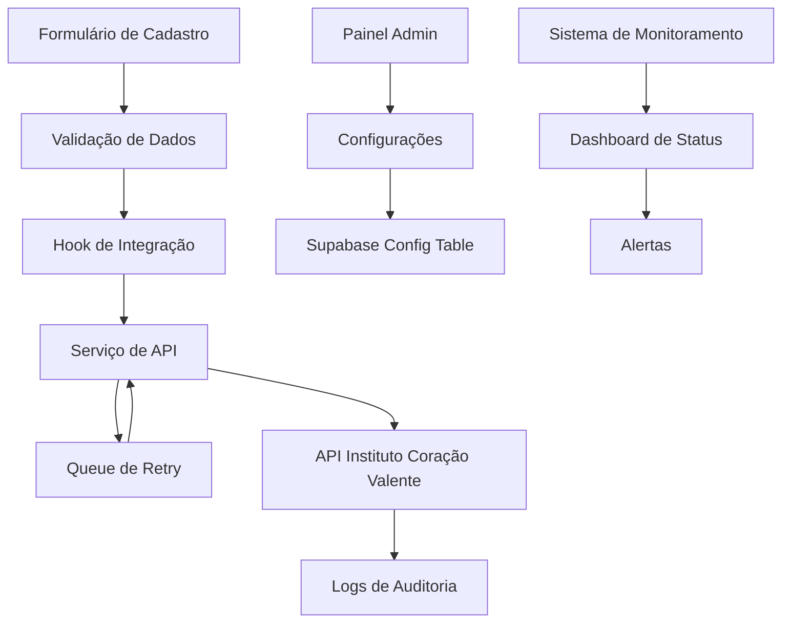

# Design Document - Integração API Instituto Coração Valente

## Overview

Este documento descreve o design técnico para a integração entre o sistema do Projeto Visão Itinerante e a API do Instituto Coração Valente. A solução será implementada seguindo os padrões arquiteturais existentes do projeto, utilizando React + TypeScript, TanStack Query para gerenciamento de estado do servidor, e Supabase como backend.

## Architecture

### Visão Geral da Arquitetura



### Fluxo de Dados

1. **Cadastro do Usuário**: Dados coletados via formulário
2. **Validação**: Validação local usando Zod schemas
3. **Consentimento**: Verificação de consentimento do usuário
4. **Envio**: Tentativa de envio para API externa
5. **Retry**: Sistema de retry em caso de falha
6. **Auditoria**: Log de todas as operações

## Components and Interfaces

### 1. Tipos e Interfaces

```typescript
// src/types/instituto-integration.ts
export interface InstitutoUserData {
  nome: string;
  email: string;
  telefone: string;
  cpf: string;
  origem_cadastro: 'visao_itinerante';
  consentimento_data_sharing: boolean;
  created_at: string;
}

export interface InstitutoApiConfig {
  endpoint: string;
  method: 'POST' | 'PUT';
  auth_type: 'api_key' | 'bearer' | 'basic';
  api_key?: string;
  bearer_token?: string;
  sandbox_endpoint?: string;
  is_sandbox: boolean;
  retry_attempts: number;
  retry_delay: number;
}

export interface IntegrationLog {
  id: string;
  user_id: string;
  status: 'success' | 'failed' | 'pending' | 'retry';
  payload: InstitutoUserData;
  response?: any;
  error_message?: string;
  attempt_count: number;
  created_at: string;
  updated_at: string;
}

export interface IntegrationStats {
  total_attempts: number;
  successful_sends: number;
  failed_sends: number;
  pending_retries: number;
  success_rate: number;
}
```

### 2. Serviço de Integração

```typescript
// src/services/instituto-integration.service.ts
export class InstitutoIntegrationService {
  private config: InstitutoApiConfig;
  
  async sendUserData(userData: InstitutoUserData): Promise<IntegrationResult>;
  async validateConfig(): Promise<boolean>;
  async retryFailedSends(): Promise<void>;
  private async makeApiRequest(data: InstitutoUserData): Promise<any>;
  private async logAttempt(log: Partial<IntegrationLog>): Promise<void>;
}
```

### 3. Custom Hook

```typescript
// src/hooks/useInstitutoIntegration.tsx
export const useInstitutoIntegration = () => {
  const sendUserData = useMutation({
    mutationFn: (userData: InstitutoUserData) => 
      institutoService.sendUserData(userData),
    onSuccess: (data) => {
      // Log success
      // Update UI
    },
    onError: (error) => {
      // Queue for retry
      // Log error
    }
  });

  const { data: stats } = useQuery({
    queryKey: ['instituto-integration-stats'],
    queryFn: () => institutoService.getStats(),
    refetchInterval: 30000 // Atualiza a cada 30s
  });

  return {
    sendUserData,
    stats,
    isLoading: sendUserData.isPending
  };
};
```

### 4. Componente de Configuração

```typescript
// src/components/admin/InstitutoConfigForm.tsx
export const InstitutoConfigForm = () => {
  const form = useForm<InstitutoApiConfig>({
    resolver: zodResolver(institutoConfigSchema)
  });

  const { mutate: saveConfig } = useMutation({
    mutationFn: (config: InstitutoApiConfig) => 
      configService.saveConfig(config),
    onSuccess: () => {
      toast.success('Configuração salva com sucesso');
    }
  });

  return (
    <Form {...form}>
      {/* Campos de configuração */}
    </Form>
  );
};
```

## Data Models

### Tabelas Supabase

```sql
-- Configurações da integração
CREATE TABLE instituto_integration_config (
  id UUID PRIMARY KEY DEFAULT gen_random_uuid(),
  endpoint TEXT NOT NULL,
  method TEXT NOT NULL DEFAULT 'POST',
  auth_type TEXT NOT NULL,
  encrypted_credentials JSONB,
  sandbox_endpoint TEXT,
  is_sandbox BOOLEAN DEFAULT true,
  retry_attempts INTEGER DEFAULT 3,
  retry_delay INTEGER DEFAULT 5000,
  is_active BOOLEAN DEFAULT true,
  created_at TIMESTAMP WITH TIME ZONE DEFAULT NOW(),
  updated_at TIMESTAMP WITH TIME ZONE DEFAULT NOW()
);

-- Logs de integração
CREATE TABLE instituto_integration_logs (
  id UUID PRIMARY KEY DEFAULT gen_random_uuid(),
  user_id UUID REFERENCES auth.users(id),
  status TEXT NOT NULL CHECK (status IN ('success', 'failed', 'pending', 'retry')),
  payload JSONB NOT NULL,
  response JSONB,
  error_message TEXT,
  attempt_count INTEGER DEFAULT 1,
  next_retry_at TIMESTAMP WITH TIME ZONE,
  created_at TIMESTAMP WITH TIME ZONE DEFAULT NOW(),
  updated_at TIMESTAMP WITH TIME ZONE DEFAULT NOW()
);

-- Fila de retry
CREATE TABLE instituto_integration_queue (
  id UUID PRIMARY KEY DEFAULT gen_random_uuid(),
  log_id UUID REFERENCES instituto_integration_logs(id),
  scheduled_for TIMESTAMP WITH TIME ZONE NOT NULL,
  attempts INTEGER DEFAULT 0,
  max_attempts INTEGER DEFAULT 3,
  created_at TIMESTAMP WITH TIME ZONE DEFAULT NOW()
);

-- Índices para performance
CREATE INDEX idx_integration_logs_status ON instituto_integration_logs(status);
CREATE INDEX idx_integration_logs_user_id ON instituto_integration_logs(user_id);
CREATE INDEX idx_integration_queue_scheduled ON instituto_integration_queue(scheduled_for);
```

### RLS Policies

```sql
-- Apenas admins podem ver configurações
CREATE POLICY "Admin access to config" ON instituto_integration_config
  FOR ALL USING (auth.jwt() ->> 'role' = 'admin');

-- Usuários podem ver apenas seus próprios logs
CREATE POLICY "Users can view own logs" ON instituto_integration_logs
  FOR SELECT USING (auth.uid() = user_id);

-- Admins podem ver todos os logs
CREATE POLICY "Admin access to all logs" ON instituto_integration_logs
  FOR ALL USING (auth.jwt() ->> 'role' = 'admin');
```

## Error Handling

### Estratégia de Retry

```typescript
export class RetryStrategy {
  private static readonly RETRY_DELAYS = [5000, 15000, 60000]; // 5s, 15s, 1min
  
  static async executeWithRetry<T>(
    operation: () => Promise<T>,
    maxAttempts: number = 3
  ): Promise<T> {
    let lastError: Error;
    
    for (let attempt = 1; attempt <= maxAttempts; attempt++) {
      try {
        return await operation();
      } catch (error) {
        lastError = error as Error;
        
        if (attempt < maxAttempts) {
          const delay = this.RETRY_DELAYS[attempt - 1] || 60000;
          await this.delay(delay);
        }
      }
    }
    
    throw lastError!;
  }
  
  private static delay(ms: number): Promise<void> {
    return new Promise(resolve => setTimeout(resolve, ms));
  }
}
```

### Tratamento de Erros Específicos

```typescript
export enum IntegrationErrorType {
  NETWORK_ERROR = 'NETWORK_ERROR',
  AUTH_ERROR = 'AUTH_ERROR',
  VALIDATION_ERROR = 'VALIDATION_ERROR',
  RATE_LIMIT = 'RATE_LIMIT',
  SERVER_ERROR = 'SERVER_ERROR'
}

export class IntegrationError extends Error {
  constructor(
    public type: IntegrationErrorType,
    message: string,
    public retryable: boolean = true
  ) {
    super(message);
  }
}
```

## Testing Strategy

### 1. Testes Unitários

```typescript
// src/services/__tests__/instituto-integration.service.test.ts
describe('InstitutoIntegrationService', () => {
  it('should send user data successfully', async () => {
    const mockUserData: InstitutoUserData = {
      nome: 'João Silva',
      email: 'joao@example.com',
      telefone: '11999999999',
      cpf: '12345678901',
      origem_cadastro: 'visao_itinerante',
      consentimento_data_sharing: true,
      created_at: new Date().toISOString()
    };

    const result = await service.sendUserData(mockUserData);
    expect(result.success).toBe(true);
  });

  it('should handle API errors gracefully', async () => {
    // Mock API error
    // Test error handling
  });
});
```

### 2. Testes de Integração

```typescript
// src/hooks/__tests__/useInstitutoIntegration.test.tsx
describe('useInstitutoIntegration', () => {
  it('should queue failed requests for retry', async () => {
    // Test retry mechanism
  });

  it('should update stats after successful send', async () => {
    // Test stats update
  });
});
```

### 3. Testes E2E

```typescript
// cypress/e2e/instituto-integration.cy.ts
describe('Instituto Integration', () => {
  it('should send user data when user consents', () => {
    // Test complete flow from form to API
  });

  it('should not send data when user does not consent', () => {
    // Test consent handling
  });
});
```

### 4. Ambiente de Teste

```typescript
// src/config/test-environment.ts
export const TEST_CONFIG = {
  INSTITUTO_API_ENDPOINT: 'https://sandbox-api.instituto.com/users',
  MOCK_RESPONSES: {
    success: { id: 'test-123', status: 'created' },
    error: { error: 'Invalid data', code: 400 }
  }
};
```

## Security Considerations

### 1. Criptografia de Credenciais

```typescript
// src/utils/encryption.ts
export class CredentialEncryption {
  static encrypt(data: string): string {
    // Implementar criptografia usando crypto-js ou similar
    // Usar chave do ambiente
  }
  
  static decrypt(encryptedData: string): string {
    // Implementar descriptografia
  }
}
```

### 2. Validação de Dados

```typescript
// src/schemas/instituto-integration.schema.ts
export const institutoUserDataSchema = z.object({
  nome: z.string().min(2).max(100),
  email: z.string().email(),
  telefone: z.string().regex(/^\d{10,11}$/),
  cpf: z.string().refine(validateCPF, 'CPF inválido'),
  origem_cadastro: z.literal('visao_itinerante'),
  consentimento_data_sharing: z.boolean().refine(val => val === true)
});
```

### 3. Rate Limiting

```typescript
// src/utils/rate-limiter.ts
export class RateLimiter {
  private static requests: Map<string, number[]> = new Map();
  
  static canMakeRequest(key: string, maxRequests: number = 10, windowMs: number = 60000): boolean {
    const now = Date.now();
    const requests = this.requests.get(key) || [];
    
    // Remove requests outside window
    const validRequests = requests.filter(time => now - time < windowMs);
    
    if (validRequests.length >= maxRequests) {
      return false;
    }
    
    validRequests.push(now);
    this.requests.set(key, validRequests);
    return true;
  }
}
```

## Performance Optimizations

### 1. Background Processing

```typescript
// src/workers/integration-worker.ts
export class IntegrationWorker {
  private queue: IntegrationJob[] = [];
  private isProcessing = false;
  
  async processQueue(): Promise<void> {
    if (this.isProcessing) return;
    
    this.isProcessing = true;
    
    while (this.queue.length > 0) {
      const job = this.queue.shift()!;
      await this.processJob(job);
    }
    
    this.isProcessing = false;
  }
}
```

### 2. Caching de Configurações

```typescript
// src/hooks/useInstitutoConfig.tsx
export const useInstitutoConfig = () => {
  return useQuery({
    queryKey: ['instituto-config'],
    queryFn: () => configService.getConfig(),
    staleTime: 5 * 60 * 1000, // 5 minutos
    cacheTime: 10 * 60 * 1000, // 10 minutos
  });
};
```

## Monitoring and Observability

### 1. Métricas

```typescript
// src/utils/metrics.ts
export class IntegrationMetrics {
  static trackSendAttempt(success: boolean, duration: number): void {
    // Enviar métricas para serviço de monitoramento
  }
  
  static trackRetryAttempt(attempt: number): void {
    // Rastrear tentativas de retry
  }
  
  static trackConfigChange(): void {
    // Rastrear mudanças de configuração
  }
}
```

### 2. Dashboard de Monitoramento

```typescript
// src/components/admin/IntegrationDashboard.tsx
export const IntegrationDashboard = () => {
  const { data: stats } = useQuery({
    queryKey: ['integration-stats'],
    queryFn: () => integrationService.getStats(),
    refetchInterval: 30000
  });

  return (
    <div className="grid grid-cols-1 md:grid-cols-3 gap-4">
      <MetricCard title="Taxa de Sucesso" value={`${stats?.success_rate}%`} />
      <MetricCard title="Envios Pendentes" value={stats?.pending_retries} />
      <MetricCard title="Total de Envios" value={stats?.total_attempts} />
    </div>
  );
};
```

## Deployment Considerations

### 1. Variáveis de Ambiente

```bash
# .env
INSTITUTO_API_ENDPOINT=https://api.instituto.com/users
INSTITUTO_SANDBOX_ENDPOINT=https://sandbox-api.instituto.com/users
INSTITUTO_API_KEY=encrypted_key_here
ENCRYPTION_KEY=your_encryption_key_here
```

### 2. Edge Functions para Processamento

```typescript
// supabase/functions/instituto-integration/index.ts
export default async function handler(req: Request) {
  // Processar integrações em background
  // Executar retries agendados
  // Enviar alertas quando necessário
}
```

### 3. Monitoramento de Saúde

```typescript
// src/utils/health-check.ts
export class HealthCheck {
  static async checkInstitutoApi(): Promise<boolean> {
    try {
      const response = await fetch(`${config.endpoint}/health`);
      return response.ok;
    } catch {
      return false;
    }
  }
}
```