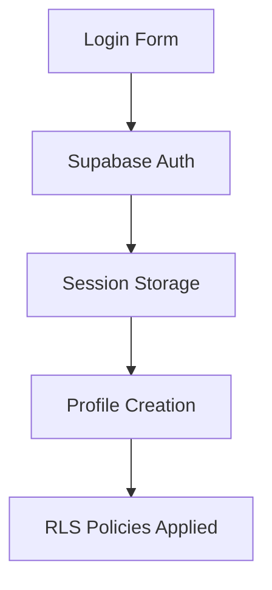

# Arquitetura do Sistema

## Visão Geral

O Instituto Coração Valente segue uma arquitetura moderna de **Single Page Application (SPA)** com backend serverless, priorizando escalabilidade, segurança e experiência do usuário.

## Padrões Arquiteturais

### 1. Component-Based Architecture
- **Atomic Design**: Componentes organizados em atoms, molecules e organisms
- **Composition over Inheritance**: Uso extensivo de composition pattern
- **Separation of Concerns**: Lógica de negócio separada da apresentação

### 2. Custom Hooks Pattern
```typescript
// Exemplo de hook customizado
const useProfessionalDashboard = () => {
  // Lógica de estado e side effects
  // Retorna interface limpa para componentes
};
```

### 3. Server State Management
- **TanStack Query**: Cache inteligente e sincronização automática
- **Optimistic Updates**: Melhor UX com atualizações imediatas
- **Background Refetching**: Dados sempre atualizados

## Estrutura de Pastas

```
src/
├── components/           # Componentes React
│   ├── ui/              # Componentes base (shadcn/ui)
│   ├── auth/            # Autenticação
│   ├── donation/        # Sistema de doações
│   ├── professional/    # Dashboard profissional
│   ├── profile/         # Perfil do usuário
│   └── [feature]/       # Agrupados por funcionalidade
├── hooks/               # Custom hooks
├── pages/               # Páginas principais
├── lib/                 # Utilitários
├── types/               # Definições TypeScript
└── integrations/        # Integrações externas
    └── supabase/        # Cliente Supabase
```

## Fluxo de Dados

### 1. Autenticação


### 2. Estado da Aplicação
```typescript
// Padrão de estado reativo
const { data, isLoading, error } = useQuery({
  queryKey: ['professional-data'],
  queryFn: fetchProfessionalData,
  enabled: !!user
});
```

### 3. Real-time Updates
- **Supabase Realtime**: Atualizações automáticas do banco
- **Channel Subscriptions**: Listening específico por tabela
- **Optimistic UI**: Interface responsiva mesmo offline

## Componentes Principais

### 1. Layout Components
- **BottomNavigation**: Navegação mobile-first
- **ErrorBoundary**: Tratamento gracioso de erros
- **LoadingSpinner**: Feedback visual consistente

### 2. Feature Components
- **ProfessionalDashboard**: Interface completa do profissional
- **DonationForm**: Fluxo de doação integrado
- **AIChatInterface**: Chat com diagnóstico por IA
- **AppointmentBooking**: Sistema de agendamento

### 3. Form Components
```typescript
// Padrão de formulário com validação
const form = useForm<FormData>({
  resolver: zodResolver(schema),
  defaultValues: {}
});
```

## Responsividade e Acessibilidade

### Mobile-First Design
- **Breakpoints Tailwind**: sm, md, lg, xl, 2xl
- **Touch-Friendly**: Botões e links otimizados para toque
- **Progressive Enhancement**: Funciona sem JavaScript

### Acessibilidade (A11y)
- **Radix UI**: Componentes acessíveis por padrão
- **ARIA Labels**: Semântica adequada
- **Keyboard Navigation**: Navegação completa por teclado
- **Screen Reader**: Suporte para leitores de tela

## Performance

### Code Splitting
```typescript
// Lazy loading de rotas
const LazyComponent = lazy(() => import('./Component'));
```

### Bundle Optimization
- **Tree Shaking**: Remoção de código não utilizado
- **Asset Optimization**: Imagens e recursos otimizados
- **Caching Strategy**: Cache inteligente via React Query

### Metrics Atuais
- **First Contentful Paint**: < 2s
- **Largest Contentful Paint**: < 3s
- **Cumulative Layout Shift**: < 0.1

## Escalabilidade

### Horizontal Scaling
- **Supabase**: Auto-scaling do backend
- **CDN**: Distribuição global de assets
- **Edge Functions**: Processamento distribuído

### Vertical Scaling
- **Database Indexing**: Otimização de queries
- **Connection Pooling**: Gerenciamento eficiente de conexões
- **Caching Layers**: Redis para dados frequentes (recomendado)

## Monitoramento e Observabilidade

### Logging
```typescript
// Structured logging
console.log('User action', {
  userId: user.id,
  action: 'donation_created',
  amount: donation.amount,
  timestamp: new Date().toISOString()
});
```

### Error Tracking
- **Error Boundaries**: Captura de erros React
- **Supabase Logs**: Edge Functions monitoring
- **User Feedback**: Sistema de feedback integrado

## Principais Decisões Arquiteturais

### 1. Por que React + Supabase?
- **Rapid Development**: Desenvolvimento ágil
- **Ecosystem**: Ecossistema maduro e estável
- **Scalability**: Escala automaticamente
- **Security**: RLS nativo do PostgreSQL

### 2. Por que TanStack Query?
- **Caching**: Cache inteligente automático
- **Synchronization**: Sincronização em tempo real
- **DevEx**: Excelente experiência de desenvolvimento

### 3. Por que TypeScript?
- **Type Safety**: Prevenção de erros em runtime
- **Developer Experience**: IntelliSense e refactoring
- **Maintainability**: Código auto-documentado

## Limitações Conhecidas

### 1. Client-Side Routing
- **SEO**: Limitações para indexação
- **Initial Load**: Primeira carga pode ser lenta
- **Mitigation**: Pre-rendering para páginas críticas

### 2. Real-time Connections
- **Connection Limits**: Limitado por plano Supabase
- **Network Dependencies**: Requer conexão estável
- **Mitigation**: Fallback para polling quando necessário

## Roadmap Arquitetural

### Próximas Melhorias
1. **Service Worker**: Funcionalidade offline
2. **Micro-frontends**: Divisão por domínio
3. **GraphQL**: API mais eficiente
4. **Server-Side Rendering**: Melhor SEO e performance

### Migrations Planejadas
1. **Database Sharding**: Para maior escala
2. **Multi-region**: Deployment global
3. **Event Sourcing**: Auditoria completa
