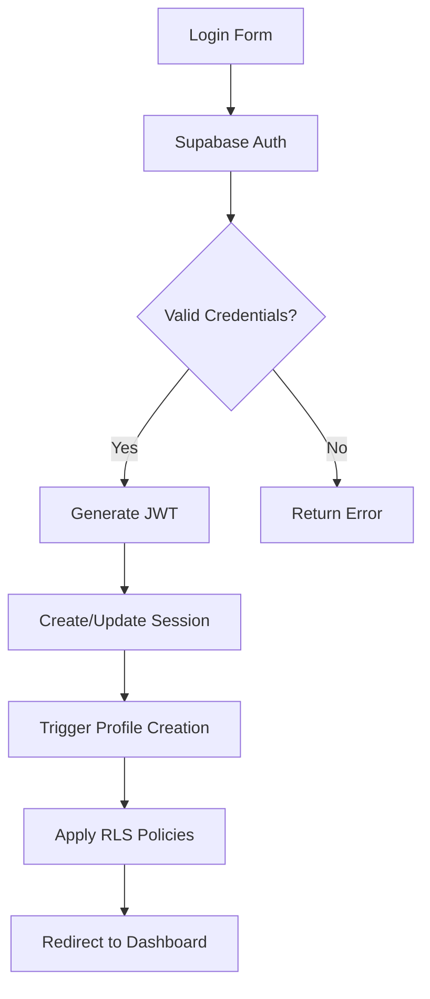

# Políticas de Segurança e Controle de Acesso

## Visão Geral

O sistema implementa múltiplas camadas de segurança, com **Row Level Security (RLS)** como principal mecanismo de controle de acesso a dados, complementado por autenticação robusta e políticas específicas por tipo de usuário.

## 1. Autenticação e Autorização

### 1.1 Supabase Authentication
```typescript
// Configuração de autenticação
const authConfig = {
  providers: ['email'],
  emailConfirmation: true,
  passwordRequirements: {
    minLength: 8,
    requireUppercase: true,
    requireLowercase: true, 
    requireNumbers: true
  }
};
```

**Características**:
- Baseado em JWT tokens
- Refresh tokens automáticos
- Session persistente no localStorage
- Multi-device support
- Password reset via email

### 1.2 Tipos de Usuário e Permissões
```typescript
enum UserRole {
  AUTHENTICATED = 'authenticated',    // Usuário logado
  ANONYMOUS = 'anon',                // Não logado
  SERVICE_ROLE = 'service_role'      // Sistema/Admin
}

enum UserType {
  COMUM = 'comum',        // Usuário padrão
  PARCEIRO = 'parceiro'   // Profissional de saúde
}
```

### 1.3 Fluxo de Autenticação


## 2. Row Level Security (RLS) Policies

### 2.1 Tabela `profiles` - Dados Pessoais
```sql
-- Política: Usuários só veem seus próprios dados
CREATE POLICY "Users can view their own profile" 
  ON public.profiles 
  FOR SELECT 
  USING (auth.uid() = id);

-- Política: Usuários só podem atualizar seus próprios dados  
CREATE POLICY "Users can update their own profile" 
  ON public.profiles 
  FOR UPDATE 
  USING (auth.uid() = id);

-- Política: Usuários só podem criar seu próprio perfil
CREATE POLICY "Users can insert their own profile" 
  ON public.profiles 
  FOR INSERT 
  WITH CHECK (auth.uid() = id);
```

**Proteção Implementada**:
- ✅ Isolamento total de dados pessoais
- ✅ Prevenção de acesso cruzado entre usuários
- ✅ Validação na inserção e atualização
- ✅ Proteção de dados médicos sensíveis

### 2.2 Tabela `partners` - Profissionais
```sql
-- Política: Qualquer um pode ver profissionais ativos
CREATE POLICY "Anyone can view active partners" 
  ON public.partners
  FOR SELECT 
  USING (is_active = true);

-- Política: Profissionais veem seus próprios dados (mesmo inativos)
CREATE POLICY "Partners can view their own profile" 
  ON public.partners
  FOR SELECT 
  USING (auth.uid() = user_id);

-- Política: Profissionais só podem atualizar próprios dados
CREATE POLICY "Partners can update their own profile" 
  ON public.partners
  FOR UPDATE 
  USING (auth.uid() = user_id);

-- Política: Profissionais podem criar próprio perfil
CREATE POLICY "Partners can insert their own profile" 
  ON public.partners
  FOR INSERT 
  WITH CHECK (auth.uid() = user_id);
```

**Proteção Implementada**:
- ✅ Visibilidade pública apenas para profissionais ativos
- ✅ Profissionais controlam seus próprios dados
- ✅ Prevenção de modificação de dados alheios
- ✅ Auto-gerenciamento de status ativo/inativo

### 2.3 Tabela `appointments` - Agendamentos
```sql
-- Política: Usuários veem seus próprios agendamentos
CREATE POLICY "Users can view their own appointments" 
  ON public.appointments
  FOR SELECT 
  USING (auth.uid() = user_id);

-- Política: Profissionais veem agendamentos com eles
CREATE POLICY "Partners can view their appointments" 
  ON public.appointments
  FOR SELECT 
  USING (
    EXISTS (
      SELECT 1 FROM public.partners p 
      WHERE p.id = partner_id AND p.user_id = auth.uid()
    )
  );

-- Política: Usuários podem criar agendamentos
CREATE POLICY "Users can create appointments" 
  ON public.appointments
  FOR INSERT 
  WITH CHECK (auth.uid() = user_id);

-- Política: Profissionais podem atualizar seus agendamentos
CREATE POLICY "Partners can update their appointments" 
  ON public.appointments
  FOR UPDATE 
  USING (
    EXISTS (
      SELECT 1 FROM public.partners p 
      WHERE p.id = partner_id AND p.user_id = auth.uid()
    )
  );
```

**Proteção Implementada**:
- ✅ Isolamento total de agendamentos por usuário
- ✅ Profissionais só veem agendamentos próprios
- ✅ Validação de propriedade na criação
- ✅ Controle de modificação baseado em relacionamento

### 2.4 Tabela `donations` - Doações Financeiras
```sql
-- Política: Usuários veem apenas suas doações
CREATE POLICY "Users can view their own donations" 
  ON public.donations
  FOR SELECT 
  USING (auth.uid() = user_id);

-- Política: Sistema pode gerenciar todas doações
CREATE POLICY "Service role can manage donations" 
  ON public.donations
  FOR ALL 
  USING (auth.jwt() ->> 'role' = 'service_role');
```

**Proteção Implementada**:
- ✅ Isolamento total de dados financeiros
- ✅ Acesso sistêmico para processamento de pagamentos
- ✅ Auditoria completa via service role
- ✅ Prevenção de acesso a doações alheias

### 2.5 Sistema de Embaixadores
```sql
-- Política: Embaixadores veem seus próprios links
CREATE POLICY "Ambassadors can view their own links" 
  ON public.ambassador_links
  FOR SELECT 
  USING (auth.uid() = ambassador_user_id);

-- Política: Embaixadores criam seus próprios links
CREATE POLICY "Ambassadors can create their own links" 
  ON public.ambassador_links
  FOR INSERT 
  WITH CHECK (auth.uid() = ambassador_user_id);

-- Política: Embaixadores veem sua própria performance
CREATE POLICY "Ambassadors can view their own performance" 
  ON public.ambassador_performance
  FOR SELECT 
  USING (auth.uid() = ambassador_user_id);

-- Política: Sistema atualiza performance dos embaixadores
CREATE POLICY "System can update ambassador performance" 
  ON public.ambassador_performance
  FOR UPDATE 
  USING (auth.uid() = ambassador_user_id);
```

**Proteção Implementada**:
- ✅ Isolamento de dados de embaixadores
- ✅ Controle de criação de links
- ✅ Performance individual protegida
- ✅ Atualizações sistêmicas controladas

### 2.6 Tabela `pre_diagnosis_sessions` - Diagnósticos
```sql
-- Política: Usuários veem suas próprias sessões
CREATE POLICY "Users can view their own diagnosis sessions" 
  ON public.pre_diagnosis_sessions
  FOR SELECT 
  USING (auth.uid() = user_id);

-- Política: Usuários criam suas próprias sessões
CREATE POLICY "Users can create their own diagnosis sessions" 
  ON public.pre_diagnosis_sessions
  FOR INSERT 
  WITH CHECK (auth.uid() = user_id);

-- Política: Usuários atualizam suas próprias sessões
CREATE POLICY "Users can update their own diagnosis sessions" 
  ON public.pre_diagnosis_sessions
  FOR UPDATE 
  USING (auth.uid() = user_id);
```

**Proteção Implementada**:
- ✅ Dados médicos totalmente isolados
- ✅ Prevenção de acesso a diagnósticos alheios
- ✅ Controle total do usuário sobre seus dados
- ✅ Histórico médico protegido

## 3. Dados Públicos e Políticas Abertas

### 3.1 Conteúdo Público
```sql
-- Política: Todos podem ver conteúdo ativo
CREATE POLICY "Anyone can view active library resources" 
  ON public.library_resources
  FOR SELECT 
  USING (is_active = true);

CREATE POLICY "Anyone can view published news articles" 
  ON public.news_articles
  FOR SELECT 
  USING (true);

CREATE POLICY "Anyone can view active services" 
  ON public.services
  FOR SELECT 
  USING (is_active = true);
```

**Justificativa**:
- Informações educacionais devem ser públicas
- Transparência em serviços oferecidos
- Marketing e engajamento do usuário

### 3.2 Dados Sistêmicos
```sql
-- Política: Apenas service role gerencia cliques
CREATE POLICY "Service role can manage link clicks" 
  ON public.link_clicks
  FOR ALL 
  USING (auth.jwt() ->> 'role' = 'service_role');
```

## 4. Funções de Segurança

### 4.1 Função `is_ambassador()`
```sql
CREATE OR REPLACE FUNCTION public.is_ambassador(user_id uuid)
RETURNS boolean
LANGUAGE sql
STABLE
SECURITY DEFINER
AS $$
  SELECT EXISTS (
    SELECT 1 
    FROM public.profiles 
    WHERE id = user_id 
    AND is_volunteer = true 
    AND ambassador_code IS NOT NULL
  );
$$;
```

**Propósito**:
- Verifica status de embaixador de forma segura
- Usado em políticas RLS avançadas
- Evita consultas complexas nas policies
- `SECURITY DEFINER` previne bypass de RLS

### 4.2 Prevenção de Recursão RLS
```sql
-- Função não usa RLS interno para evitar loops
CREATE OR REPLACE FUNCTION check_user_permissions(user_id uuid)
RETURNS boolean
LANGUAGE sql
SECURITY DEFINER
SET search_path = public
AS $$
  -- Consulta direta sem RLS
  SELECT EXISTS (SELECT 1 FROM auth.users WHERE id = user_id);
$$;
```

## 5. Proteção contra Vulnerabilidades

### 5.1 SQL Injection Prevention
```typescript
// ✅ CORRETO: Uso de prepared statements
const { data } = await supabase
  .from('profiles')
  .select('*')
  .eq('user_id', userId); // Parametrizado automaticamente

// ❌ EVITADO: Concatenação de strings
// const query = `SELECT * FROM profiles WHERE user_id = '${userId}'`;
```

**Medidas Implementadas**:
- Supabase SDK previne SQL injection automaticamente
- Validação de entrada com Zod
- Sanitização de dados em Edge Functions
- Prepared statements sempre utilizados

### 5.2 Cross-Site Scripting (XSS) Prevention
```typescript
// Sanitização automática do React
const ProfileComponent = ({ profile }) => (
  <div>
    {/* React escapa automaticamente */}
    <h1>{profile.full_name}</h1>
    
    {/* Para HTML raw, usar DOMPurify */}
    <div dangerouslySetInnerHTML={{
      __html: DOMPurify.sanitize(profile.bio)
    }} />
  </div>
);
```

**Medidas Implementadas**:
- React escapa output automaticamente
- DOMPurify para conteúdo HTML
- Content Security Policy (CSP) headers
- Validação de entrada rigorosa

### 5.3 Cross-Site Request Forgery (CSRF) Prevention
```typescript
// Headers CORS em Edge Functions
const corsHeaders = {
  'Access-Control-Allow-Origin': 'https://app.institutovalente.org',
  'Access-Control-Allow-Headers': 'authorization, x-client-info, apikey, content-type',
  'Access-Control-Allow-Methods': 'GET, POST, PUT, DELETE, OPTIONS'
};
```

**Medidas Implementadas**:
- CORS restritivo em produção
- JWT tokens com short expiration
- SameSite cookies quando aplicável
- Validação de origem em requests

## 6. Segurança de Edge Functions

### 6.1 Autenticação de Functions
```typescript
// Verificação de token JWT
const authHeader = req.headers.get('Authorization');
if (!authHeader) {
  return new Response('Unauthorized', { status: 401 });
}

const token = authHeader.replace('Bearer ', '');
const { data: user, error } = await supabase.auth.getUser(token);

if (error || !user) {
  return new Response('Invalid token', { status: 401 });
}
```

### 6.2 Validação de Entrada
```typescript
// Schema validation em Edge Functions
const requestSchema = z.object({
  amount: z.number().min(500).max(100000000),
  donor_email: z.string().email(),
  payment_method: z.enum(['CREDIT_CARD', 'PIX'])
});

try {
  const validData = requestSchema.parse(await req.json());
} catch (error) {
  return new Response('Invalid input', { status: 400 });
}
```

### 6.3 Rate Limiting
```typescript
// Rate limiting por IP
const rateLimiter = new Map();

const checkRateLimit = (ip: string, limit: number = 10) => {
  const now = Date.now();
  const windowStart = now - (60 * 1000); // 1 minuto
  
  if (!rateLimiter.has(ip)) {
    rateLimiter.set(ip, []);
  }
  
  const requests = rateLimiter.get(ip)
    .filter(time => time > windowStart);
  
  if (requests.length >= limit) {
    return false;
  }
  
  requests.push(now);
  rateLimiter.set(ip, requests);
  return true;
};
```

## 7. Auditoria e Logs

### 7.1 Log de Ações Críticas
```typescript
const auditLog = async (action: string, userId: string, details: any) => {
  await supabase.from('audit_logs').insert({
    user_id: userId,
    action,
    details: JSON.stringify(details),
    ip_address: req.headers.get('x-forwarded-for'),
    user_agent: req.headers.get('user-agent'),
    timestamp: new Date().toISOString()
  });
};

// Exemplo de uso
await auditLog('donation_created', user.id, {
  amount: donation.amount,
  payment_method: donation.payment_method
});
```

### 7.2 Retenção e Purge de Logs
```sql
-- Função para limpar logs antigos
CREATE OR REPLACE FUNCTION purge_old_logs()
RETURNS void AS $$
BEGIN
  DELETE FROM audit_logs 
  WHERE created_at < NOW() - INTERVAL '90 days';
END;
$$ LANGUAGE plpgsql;

-- Scheduled para rodar diariamente
```

## 8. Criptografia e Proteção de Dados

### 8.1 Dados em Trânsito
- **HTTPS obrigatório**: Todos endpoints em TLS 1.3
- **Certificate Pinning**: Implementado no cliente
- **HSTS Headers**: Forçar HTTPS sempre

### 8.2 Dados em Repouso
```sql
-- Criptografia de campos sensíveis (exemplo futuro)
CREATE EXTENSION IF NOT EXISTS pgcrypto;

ALTER TABLE profiles 
ADD COLUMN medical_conditions_encrypted TEXT;

-- Função para criptografar
CREATE OR REPLACE FUNCTION encrypt_medical_data(data TEXT)
RETURNS TEXT AS $$
BEGIN
  RETURN crypt(data, gen_salt('bf', 8));
END;
$$ LANGUAGE plpgsql;
```

### 8.3 Chaves e Secrets
```typescript
// Gerenciamento seguro de secrets
const secrets = {
  ASAAS_API_KEY: Deno.env.get('ASAAS_API_KEY'),
  OPENAI_API_KEY: Deno.env.get('OPENAI_API_KEY'),
  // Nunca hardcoded no código
};

// Validação na inicialização
if (!secrets.ASAAS_API_KEY) {
  throw new Error('Missing required ASAAS_API_KEY');
}
```

## 9. Compliance e Regulamentações

### 9.1 LGPD (Lei Geral de Proteção de Dados)
```typescript
// Implementação do direito ao esquecimento
const deleteUserData = async (userId: string) => {
  // Anonimizar dados ao invés de deletar (para auditoria)
  await supabase.from('profiles').update({
    full_name: 'Usuário Removido',
    email: 'removido@exemplo.com',
    phone: null,
    medical_conditions: null,
    // Manter ID para integridade referencial
  }).eq('id', userId);
};
```

### 9.2 Consentimento e Transparência
```typescript
// Registro de consentimentos
const logConsent = async (userId: string, consentType: string) => {
  await supabase.from('user_consents').insert({
    user_id: userId,
    consent_type: consentType,
    granted_at: new Date().toISOString(),
    ip_address: req.headers.get('x-forwarded-for')
  });
};
```

## 10. Monitoramento de Segurança

### 10.1 Detecção de Anomalias
```typescript
// Monitoramento de padrões suspeitos
const detectSuspiciousActivity = (userId: string, actions: string[]) => {
  const rapidActions = actions.filter(
    action => Date.now() - new Date(action.timestamp).getTime() < 1000
  );
  
  if (rapidActions.length > 10) {
    // Possível bot ou ataque
    triggerSecurityAlert(userId, 'rapid_actions');
  }
};
```

### 10.2 Alertas de Segurança
```typescript
const securityAlerts = {
  failedLogins: { threshold: 5, window: '5 minutes' },
  rapidRequests: { threshold: 100, window: '1 minute' },
  suspiciousPatterns: { enabled: true, autoBlock: false }
};
```

## 11. Backup e Recovery

### 11.1 Estratégia de Backup
- **Backup automático**: Diário via Supabase
- **Point-in-time recovery**: 7 dias
- **Backup manual**: Antes de deploys críticos
- **Teste de restore**: Mensal

### 11.2 Disaster Recovery
```typescript
// Plano de contingência
const recoveryPlan = {
  rto: '4 hours',      // Recovery Time Objective
  rpo: '1 hour',       // Recovery Point Objective
  backupSites: ['us-east-1', 'eu-west-1'],
  criticalSystems: ['auth', 'payments', 'medical_data']
};
```

## 12. Recomendações de Segurança

### 12.1 Implementações Futuras
1. **Two-Factor Authentication (2FA)**
2. **Device fingerprinting**
3. **Behavioral analysis**
4. **Advanced threat detection**
5. **Zero-trust architecture**

### 12.2 Revisões Periódicas
- **Security audit**: Trimestral
- **Penetration testing**: Semestral
- **Dependency updates**: Mensal
- **Policy review**: Anual

### 12.3 Treinamento da Equipe
- **Security awareness**: Trimestral
- **Incident response**: Semestral
- **Best practices**: Contínuo
- **Compliance updates**: Conforme necessário
