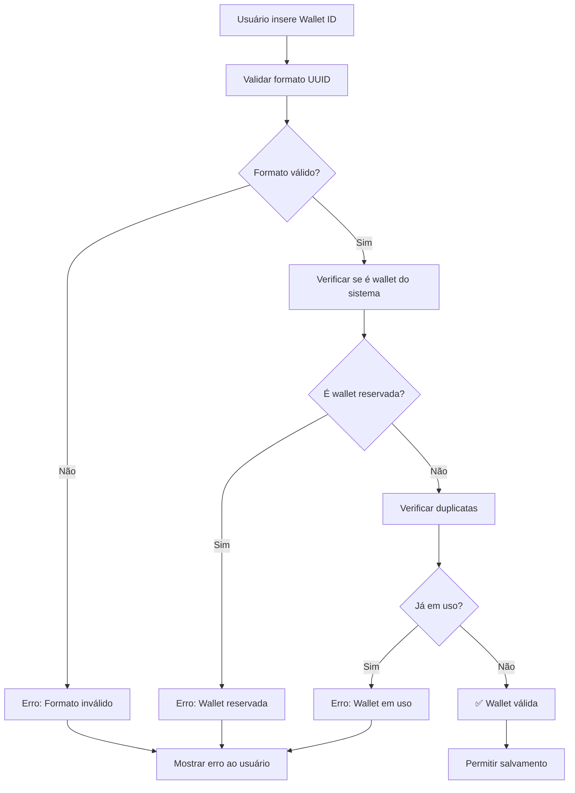

# Validação de Wallet ID - Sistema de Embaixadores

## 📋 Visão Geral

Este documento descreve o sistema de validação de Wallet IDs implementado para prevenir conflitos e duplicidades no sistema de split de pagamentos.

## 🎯 Objetivos

- **Prevenir duplicidade**: Cada Wallet ID pode ser usada por apenas um embaixador
- **Proteger wallets do sistema**: Impedir uso de wallets reservadas
- **Garantir formato correto**: Validar formato UUID
- **Auditoria**: Registrar todas as validações e mudanças

## 🔒 Wallets Reservadas do Sistema

As seguintes Wallet IDs são **reservadas** e não podem ser usadas por embaixadores:

```typescript
const SYSTEM_WALLETS = [
  'eff311bc-7737-4870-93cd-16080c00d379', // Instituto Coração Valente
  'f9c7d1dd-9e52-4e81-8194-8b666f276405', // Renum (Administrador)
  'c0c31b6a-2481-4e3f-a6de-91c3ff834d1f'  // Wallet Especial (sem embaixador)
];
```

## ✅ Validações Implementadas

### 1. **Validação de Formato**
- Deve ser um UUID válido
- Formato: `xxxxxxxx-xxxx-xxxx-xxxx-xxxxxxxxxxxx`
- Case insensitive (convertido para lowercase)

### 2. **Validação de Sistema**
- Verifica se não é uma wallet reservada
- Impede conflitos com wallets do sistema

### 3. **Validação de Unicidade**
- Verifica se já está em uso por outro embaixador
- Permite que o próprio usuário mantenha sua wallet

### 4. **Validação de Rede**
- Trata erros de conexão
- Fornece feedback adequado ao usuário

## 🛠️ Implementação Técnica

### **Frontend (React)**

```typescript
import { validateWalletId } from '@/utils/walletValidation';

const result = await validateWalletId(walletId, currentUserId);

if (!result.isValid) {
  // Tratar erro baseado em result.errorType
  console.error(result.message);
}
```

### **Backend (PostgreSQL)**

```sql
-- Constraint de unicidade
CREATE UNIQUE INDEX unique_ambassador_wallet_id 
ON profiles (ambassador_wallet_id) 
WHERE ambassador_wallet_id IS NOT NULL;

-- Trigger de validação
CREATE TRIGGER validate_ambassador_wallet_trigger
  BEFORE INSERT OR UPDATE ON profiles
  FOR EACH ROW
  EXECUTE FUNCTION validate_ambassador_wallet_id();
```

## 📊 Tipos de Erro

| Tipo | Descrição | Ação do Usuário |
|------|-----------|-----------------|
| `format` | Formato UUID inválido | Corrigir formato |
| `system` | Wallet reservada do sistema | Usar outra wallet |
| `duplicate` | Já em uso por outro embaixador | Usar outra wallet |
| `network` | Erro de conexão | Tentar novamente |

## 🔍 Auditoria

### **Logs de Validação**
```typescript
logWalletValidation(walletId, result, userId);
```

### **Histórico de Mudanças**
- Todas as alterações de Wallet ID são registradas
- Tabela `audit_log` mantém histórico completo
- Inclui valores antigos e novos

## 🚀 Fluxo de Validação



## 🔧 Manutenção

### **Adicionar Nova Wallet do Sistema**
1. Atualizar `SYSTEM_WALLETS` em `src/utils/walletValidation.ts`
2. Atualizar função `validate_ambassador_wallet_id()` no banco
3. Executar migração para limpar wallets existentes

### **Remover Validação Temporariamente**
```sql
-- Desabilitar trigger temporariamente
ALTER TABLE profiles DISABLE TRIGGER validate_ambassador_wallet_trigger;

-- Reabilitar após manutenção
ALTER TABLE profiles ENABLE TRIGGER validate_ambassador_wallet_trigger;
```

## 📈 Monitoramento

### **Métricas Importantes**
- Número de tentativas de wallet duplicada
- Tentativas de uso de wallets do sistema
- Erros de validação por tipo
- Taxa de sucesso na validação

### **Queries de Monitoramento**
```sql
-- Wallets duplicadas tentadas (últimos 7 dias)
SELECT COUNT(*) as tentativas_duplicadas
FROM audit_log 
WHERE action = 'wallet_validation_failed'
  AND new_values->>'errorType' = 'duplicate'
  AND created_at >= NOW() - INTERVAL '7 days';

-- Tentativas de uso de wallets do sistema
SELECT COUNT(*) as tentativas_sistema
FROM audit_log 
WHERE action = 'wallet_validation_failed'
  AND new_values->>'errorType' = 'system'
  AND created_at >= NOW() - INTERVAL '7 days';
```

## 🚨 Troubleshooting

### **Problema**: Usuário não consegue salvar wallet válida
**Solução**: Verificar se não há problema de rede ou se a wallet não foi recentemente usada por outro usuário

### **Problema**: Erro "Wallet já em uso" para o próprio usuário
**Solução**: Verificar se o `currentUserId` está sendo passado corretamente na validação

### **Problema**: Validação muito lenta
**Solução**: Verificar índices no banco e otimizar queries de verificação

## 📝 Changelog

### v1.0.0 (2025-03-09)
- ✅ Implementação inicial
- ✅ Validação de formato UUID
- ✅ Blacklist de wallets do sistema
- ✅ Verificação de duplicatas
- ✅ Sistema de auditoria
- ✅ Triggers no banco de dados
- ✅ Utilitários frontend centralizados